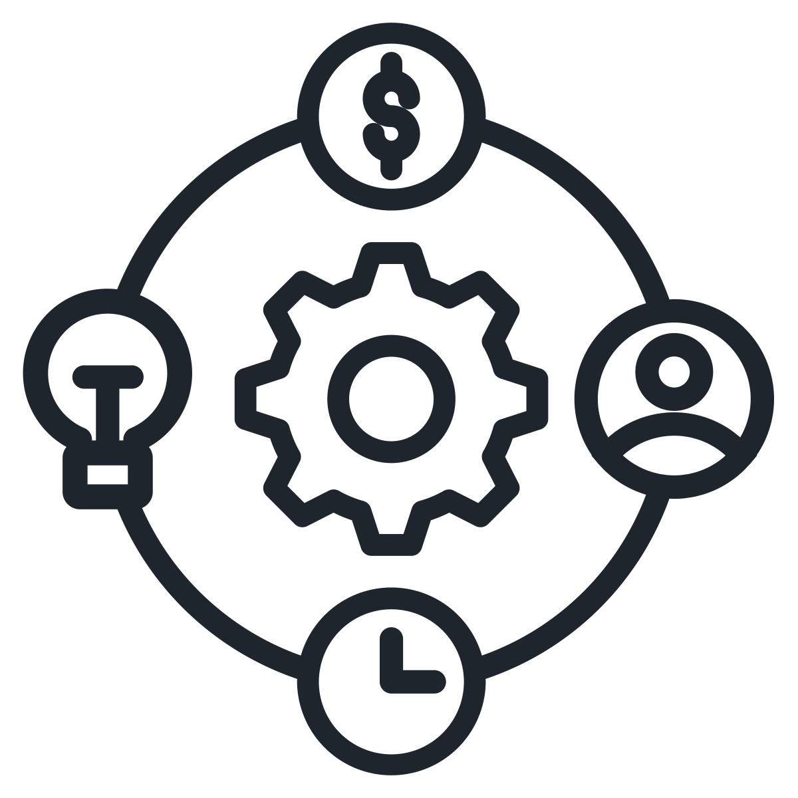
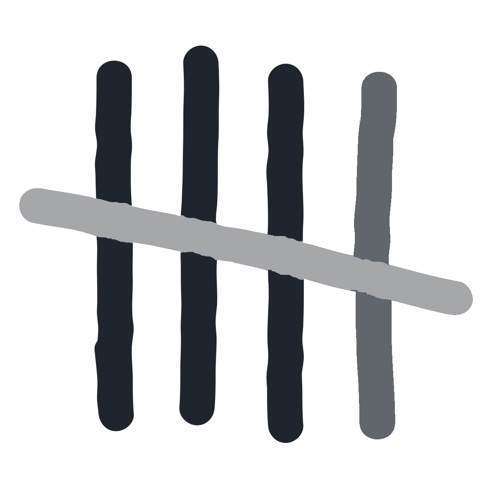

<h3>Our general approach</h3> <!-- consider using icons next to each bullet -->

<b>Step 1:</b> Research to identify gaps in the landscape of efforts to fulfill this mission.

<b>Step 2:</b> Determine what new organizations should exist to address these challenges

<b>Step 3:</b> Targeted headhunting to identify people to found the specific ideas we select

<b>Step 4:</b> Provide various forms of support to ease the process of starting the new organization and increase the likelihood of success

 

<b>We aim to help start 3 to 5 new organizations per year.</b>

There are other approaches we expect to sometimes pursue, and other activities that FLF may take on. As a new organization, we’re unsure just how narrow or expansive we’ll find our scope of activities to be.

<h3>Cause Prioritization</h3>
<!--<ol>
<li>We expect our most significant focus to be on the risks posed by transformative AI, and governance mechanisms needed to ensure that AI is beneficial to humanity.</li>
<li>Other areas of work could include biosecurity, nuclear technology, other risks to humanity’s existence or fulfillment of its potential, and the development of tools, institutions, and communities that support these efforts.</li></ol>-->

We expect our most significant focus to be on the risks posed by transformative AI, and governance mechanisms needed to ensure that AI is beneficial to humanity. Other areas of work could include biosecurity, nuclear technology, other risks to humanity’s existence or fulfillment of its potential, and the development of tools, institutions, and communities that support these efforts.

<a href="/recruitment" class="button fit" style="margin-top: 2rem; padding: 0;">We're Hiring</a>

