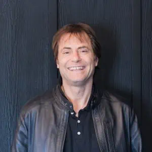
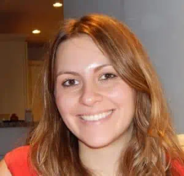

<!--

<!--

-->
<!--

<b>Anthony Aguirre</b> is the <i><b>Executive Director & President of the Board</b></i> at the Future of Life Foundation. He is also the Executive Director at the <a>Future of Life Institute</a> and the Faggin Presidential Professor for the Physics of Information at UC Santa Cruz. He has done research in an array of topics in theoretical cosmology, gravitation, statistical mechanics, and other fields of physics. He also has strong interest in science outreach, and has appeared in numerous science documentaries. He is a creator of the science and technology prediction platform <a>Metaculus.com</a>, and is founder (with Max Tegmark) of the <a>Foundational Questions Institute.</a>

<b>Josh Jacobson</b> is the <b><i>Chief Operating Officer</i></b> at the Future of Life Foundation. He has worked across organizational leadership, operations, and/or research for <a>ARC Evals</a>, <a>FAR AI</a>, <a>Anthropic</a>, on a research grant, for the <a>Future for Humanity Institute</a> (<a>EpiFor</a>), the <a>Berkeley Existential Risk Initiative</a>, <a>the World Bank</a>, <a>SocialCops</a>, <a>Innovations for Poverty Action</a>, the <a>Centre for Effective Altruism</a>, a tech startup, and PepsiCo. Josh holds an MPA with a focus in Econometrics in International Development from Columbia University’s School of International and Public Affairs and a Bachelor’s in International Relations and Government from Dartmouth College. 

-->

<h2>Staff</h2>

<ul class="actions vertical">
<li></li></ul>

<ul class="actions vertical">
<li><b>Anthony Aguirre</b> is the <i><b>Executive Director & President of the Board</b></i> at the Future of Life Foundation. He is also the Executive Director at the <a>Future of Life Institute</a> and the Faggin Presidential Professor for the Physics of Information at UC Santa Cruz. He has done research in an array of topics in theoretical cosmology, gravitation, statistical mechanics, and other fields of physics. He also has strong interest in science outreach, and has appeared in numerous science documentaries. He is a creator of the science and technology prediction platform <a>Metaculus.com</a>, and is founder (with Max Tegmark) of the <a>Foundational Questions Institute.</a></li>
</ul>

<ul class="actions vertical">
<li></li></ul>

<ul class="actions vertical">
<li><b>Josh Jacobson</b> is the <b><i>Chief Operating Officer</i></b> at the Future of Life Foundation. He has worked across organizational leadership, operations, and/or research for <a>ARC Evals</a>, <a>FAR AI</a>, <a>Anthropic</a>, on a research grant, for the <a>Future for Humanity Institute</a> (<a>EpiFor</a>), the <a>Berkeley Existential Risk Initiative</a>, <a>the World Bank</a>, <a>SocialCops</a>, <a>Innovations for Poverty Action</a>, the <a>Centre for Effective Altruism</a>, a tech startup, and PepsiCo. Josh holds an MPA with a focus in Econometrics in International Development from Columbia University’s School of International and Public Affairs and a Bachelor’s in International Relations and Government from Dartmouth College.</li>
</ul>

<h2 style="margin-top: 1rem;">Board of Directors</h2>

<b>Anthony Aguirre</b> (see bio above)

<b>Jaan Tallinn</b> Cofounder, CSER & Skype

<b>Max Tegmark</b> Professor, MIT & Author, Our Mathematical Universe

<b>Meia Chita-Tegmark</b> Co-Founder FLI 

